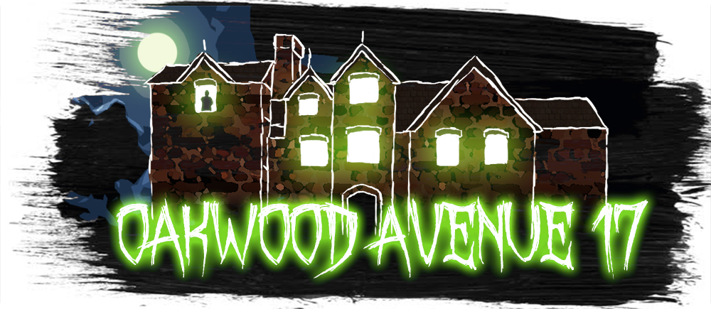

<!-- PROJECT LOGO -->
<p align="center">
  <a href="https://github.com/bearbob/Oakwood-Avenue-17">
    
  </a>

  <h3 align="center">Oakwood Avenue 17</h3>

  <p align="center">
    A german mystery-horror adventure where you choose what comes next!
    <br />
    <a href="https://github.com/bearbob/Oakwood-Avenue-17/wiki"><strong>Explore the docs »</strong></a>
    <br />
    <br />
    <a href="https://github.com/bearbob/Oakwood-Avenue-17/issues/new">Report Bug</a>
    ·
    <a href="https://github.com/bearbob/Oakwood-Avenue-17/issues">Request Feature</a>
  </p>
</p>

Dunkle Gerüchte ranken sich um das Haus in der Oakwood Avenue 17. In der kleinen Stadt hat jede Familie eine eigene Version der Geschichte, die dort passiert sein soll. Auf einem alten Friedhof erbaut, vom Geist seines Erbauers heimgesucht, von einer Hexe verflucht, die Auswahl ist groß. Fest steht, dass dort dunkle Dinge vor sich gehen und man sich lieber fernhält. 
Das gilt aber nicht für dich, denn dein neuer Job fordert von dir genau das - den Weg durch die staubverhangenen Zimmer. Ob es hier wirklich spukt, wirst du schon noch herausfinden...

## Markos

### \block{<Name_des_Markers>}{<Überschift>}

Beginnt einen neuen Textblock und generiert eine Referenznummer, die im Text aufgerufen werden kann.
Beispiel: ```\block{theIntersectionRoomFromDungeon}{Ich habe die Wahl}```

### \goto{<Name_des_Markers>}

Erzeugt eine neue Referenz auf einen Textblock, der mit `\block{..}{..}` erzeugt wurde.
Im Text wird die Nummer des referenzierten Blocks ausgegeben.

### \getItem{<Name_des_Markers>}

Erzeugt eine neue Referenz auf eine Gegenstandsbeschreibung, die mit `\inventory{..}` erzeugt wurde.
Im Text wird der Buchstabe 'G' und die Nummer des referenzierten Gegenstands ausgegeben, z.B. `G16`.

### \inventory{<Name_des_Markers>}

Erzeugt eine neuen Zielreferenz für eine Gegenstandsbeschreibung.

### \setEvent{<Name_des_Markers>}

Erzeugt eine neuen Zielreferenz für eine Ereignisbeschreibung.

### \getEvent{<Name_des_Markers>}

Erzeugt eine neue Referenz auf eine Ereignisbeschreibung, die mit `\setEvent{..}` erzeugt wurde.
Im Text wird der Buchstabe 'E' und die Nummer des referenzierten Gegenstands ausgegeben, z.B. `E4`.

# Credits

* [rpgtex/DND-5e-LaTeX-Template](https://github.com/rpgtex/DND-5e-LaTeX-Template)
